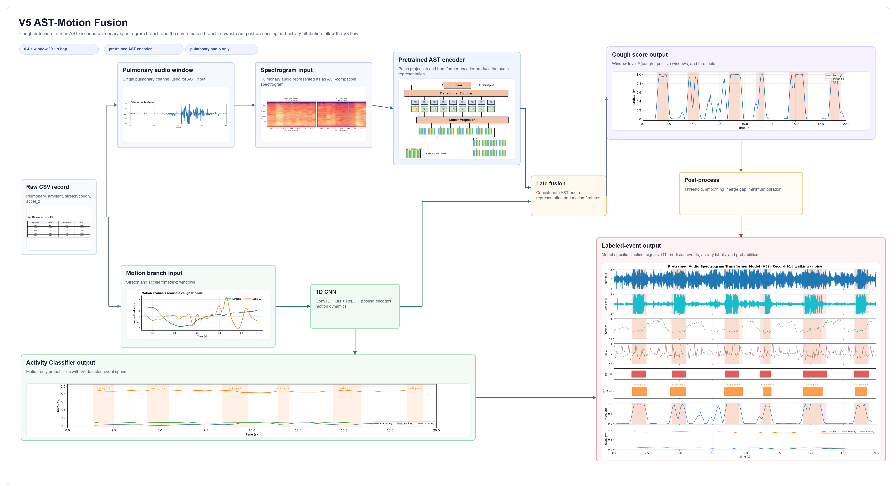
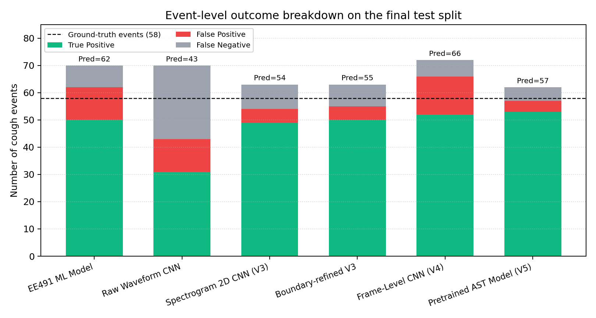
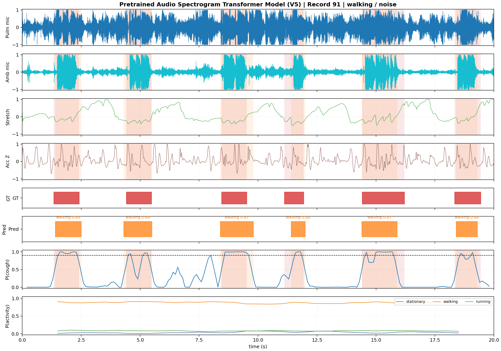

# Multi-Sensor Cough Analysis and Activity Classification

EE491-EE492 senior design project by Abdulhalim Kiraz, supervised by Prof. Dr. Yasemin Kahya.

This repository contains a research prototype for detecting cough intervals from wearable multi-sensor recordings and assigning an activity state to the detected cough events. The system uses synchronized pulmonary audio, ambient audio, stretch sensor, and accelerometer signals. The final output is not just a cough/non-cough window label; it is a set of cough events on the time axis, each with an estimated activity label.

## Project Summary

The project was developed over two semesters. In EE491, I built a classical machine-learning baseline with hand-crafted multi-sensor features and XGBoost. In EE492, I extended the project into a full event-level deep-learning pipeline with raw waveform CNNs, log-Mel spectrogram CNNs, a frame-level CNN detector, a frozen Audio Spectrogram Transformer model, and a separate motion-based activity classifier.

The final experiments use one cleaned dataset protocol and one shared record-level split across all model families. This makes the comparison fair: the same train, validation, and test records are used for the classical baseline, CNN models, frame-level model, and pretrained AST model.

## Dataset

The final dataset contains:

| Item | Value |
| --- | ---: |
| Recordings | 107 |
| Subjects | 9 |
| Duration | about 2140 s |
| Ground-truth cough events | 352 |
| Sampling rate | 4800 Hz |
| Channels | 4 synchronized channels |

Each CSV recording has four integer columns:

| Column | Signal |
| ---: | --- |
| 1 | Pulmonary microphone |
| 2 | Ambient microphone |
| 3 | Stretch sensor + bit-packed cough label |
| 4 | Accelerometer Z-axis |

The cough label is stored in the least significant bit of channel 3:

```text
cough_label[n] = channel3[n] & 1
stretch[n]     = channel3[n] >> 1
```

For privacy reasons, the raw sensor CSV files and subject-level metadata are intentionally not included in the public repository. The code expects the private dataset to be placed under `data/clean_v4/` when reproducing the full experiments locally.

## Method

All final cough detectors follow the same high-level pipeline:

1. Decode the bit-packed stretch/label channel.
2. Band-pass audio channels between 60 Hz and 2200 Hz.
3. Resample motion channels to 100 Hz and low-pass filter at 20 Hz.
4. Estimate cough probability with one of the model families.
5. Convert probabilities into event intervals using validation-selected threshold, minimum-duration, smoothing, and merge-gap settings.
6. Attach activity labels by averaging motion-based activity probabilities around each matched cough event.

The activity classifier is deliberately separate from the cough detector. This keeps the evaluation interpretable: cough event detection is measured with event precision, recall, and F1, while activity classification is measured both standalone and on matched cough events.

## Final Models

| Model | Main idea | Window / hop |
| --- | --- | --- |
| EE491 ML baseline | 8 hand-crafted features + XGBoost | 0.2 s / 0.05 s |
| Raw Waveform CNN | 1D CNN over filtered audio and motion | 1.0 s / 0.5 s |
| Spectrogram 2D CNN (V3) | 2D CNN over two-channel log-Mel audio + motion branch | 1.0 s / 0.25 s |
| Boundary-refined V3 | Same V3 architecture with shorter windows for sharper event boundaries | 0.4 s / 0.1 s |
| Frame-Level CNN (V4) | Dense 10 ms cough probability timeline | 5.0 s chunks |
| Pretrained AST (V5) | Frozen Audio Spectrogram Transformer embedding + motion fusion | 0.4 s / 0.1 s |
| Activity Classifier | Motion-only CNN for stationary, walking, running | 3.0 s / 0.5 s |



## Main Results

The main metric is event-level cough detection on the final held-out test split. The test split contains 17 records, 340 seconds of recordings, and 58 ground-truth cough events.

| Model | Precision | Recall | Event F1 | TP | FP | FN |
| --- | ---: | ---: | ---: | ---: | ---: | ---: |
| EE491 ML baseline | 0.806 | 0.862 | 0.833 | 50 | 12 | 8 |
| Raw Waveform CNN | 0.721 | 0.534 | 0.614 | 31 | 12 | 27 |
| Spectrogram 2D CNN (V3) | 0.907 | 0.845 | 0.875 | 49 | 5 | 9 |
| Boundary-refined V3 | 0.909 | 0.862 | 0.885 | 50 | 5 | 8 |
| Frame-Level CNN (V4) | 0.788 | 0.897 | 0.839 | 52 | 14 | 6 |
| Pretrained AST (V5) | **0.930** | **0.914** | **0.922** | **53** | **4** | **5** |



The V5 model produced the strongest final cough detector. It reached 0.922 event F1 and produced only 4 false-positive events on the final test split. The boundary-refined V3 model is also important because it is simpler and still reached 0.885 event F1.

For activity classification, the motion-only Activity Classifier reached 0.884 standalone window accuracy and 0.905 macro F1. When attached to the stronger cough detectors, matched-event activity accuracy was above 0.90. The final V5 + Activity pipeline reached 0.906 matched-event activity accuracy over 53 matched cough events.



## Demo

Live demo: [ee492-senior-project-demo.streamlit.app](https://ee492-senior-project-demo.streamlit.app/)

The Streamlit demo lives in `app/` and runs the checkpoint-backed cough detection pipeline. Raw sensor recordings and subject metadata are not included in this repository; use the upload option or place the private dataset under `data/clean_v4/` for preset records.

```bash
.venv/bin/python -m streamlit run app/streamlit_app.py
```

For Streamlit Community Cloud, set the app entrypoint to `app/streamlit_app.py`.

If the app has been inactive for a while, Streamlit may show a wake-up screen before loading it.

## Repository Structure

```text
src/cough_analysis/   Reusable preprocessing, model, windowing, and event metric code
scripts/              Training, evaluation, reporting, and prediction scripts
configs/final/        Final experiment configurations used in the report
app/                  Streamlit demo used for the project presentation
docs/                 Supporting notes and README figures
report/               Final report PDF
presentation/         Final presentation source/PDF, if included locally
tests/                Lightweight unit tests for core pipeline behavior
data/                 Dataset scripts and documentation; raw/private data excluded
artifacts/            Selected demo checkpoints; generated outputs excluded
```

## Setup

The project targets Python 3.11 or 3.12. A typical local setup is:

```bash
python3.12 -m venv .venv
source .venv/bin/activate
.venv/bin/python -m pip install --upgrade pip
.venv/bin/python -m pip install -r requirements.txt
.venv/bin/python -m pip install -r requirements-dev.txt
```

Run the lightweight test suite:

```bash
make test
```

Check the environment and dataset paths:

```bash
make env-check
```

The full training and evaluation scripts require the private dataset and model artifacts to be present locally.

## Reports

- Final report: `report/EE492_FinalReport_AbdulhalimKiraz.pdf`
- Final presentation: `report/EE492_FinalPresentation_AbdulhalimKiraz.pdf`

## Limitations

This is a senior-design research prototype, not a medical diagnosis tool. The dataset is still small and imbalanced, especially for the running class. The evaluation uses an internal record-level split rather than an external dataset. Any real deployment would need more subjects, more recording conditions, careful consent handling, and minimal raw-audio storage.
